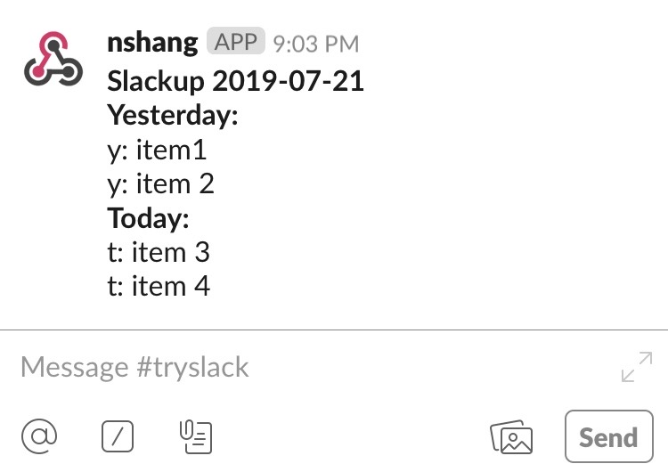

# Slackup: Standup Meeting in Cyberspace

This is a simple command line tool to send yesterday and today's status
update messages to a Slack channel, using an [Incoming
Webhook](https://api.slack.com/incoming-webhooks).

To see how to send a Slack message from a Google form, see the GitHub repo
[syncom/google-forms-to-slack](https://github.com/syncom/google-forms-to-slack).

## Usage

1. Install the [Incoming Webhooks
application](https://api.slack.com/incoming-webhooks) in your Slack workspace. Obtain the associated webhook URL.

2. Before the first use, edit [.config](./.config) to update values for
configuration entries `webhook_url`, `username`, and `channel`, where
    - `webhook_url` is the webhook URL we have obtained
    - `username` is the system username under which the script is run. Note that this entry must match the runtime username, otherwise an error shall occur
    - `channel` is the name of the Slack channel to which the update message
    is sent. It is of the form #channel_name

3. Run `python3 slackup.py` from command line, and enter the status update
message upon prompt. The synopsis is as follows.

    ```bash
    usage: slackup.py [-h]

    Slackup: send yesterday and today's status update to Slack.

    Before first use, edit .config to add appropriate values for the webhook URL, username, and Slack channel name.
    At prompt, enter status update for yesterday and today.  It takes multiline input for status update. Press Enter twice to complete input.
    Example:

    python3 slackup.py
    Slackup. Press Enter button twice to complete daily update
    Yesterday:
    y: item1
    y: item 2

    Today:
    t: item 3
    t: item 4

    HTTP response status:  200

    optional arguments:
    -h, --help  show this help message and exit
    ```

    If everything is set up properly, you should receive a Slackup message in
    your Slack channel (as in the screen shot below).

    
